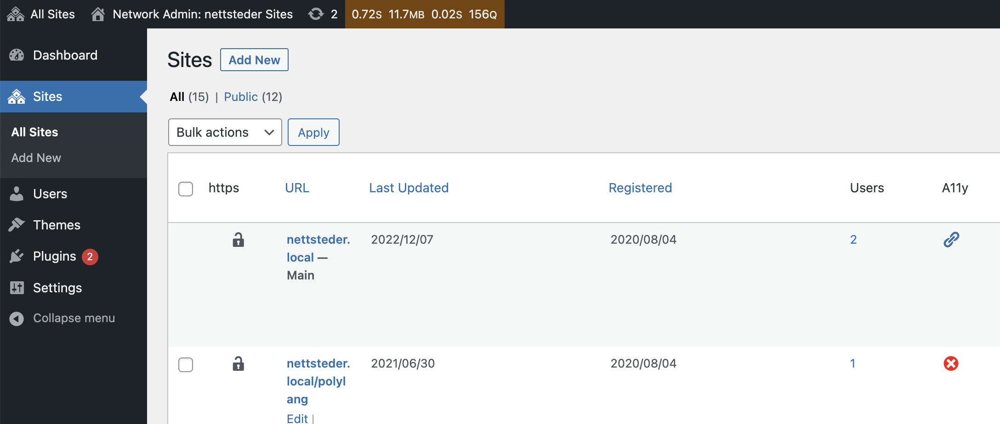

# A11y link checker

Check if a site has a link to the accessibility statement.

> NOTE: Expects, per site, that the URL to the accessibility statement is in the option `options_uu_url` in the options table.

## Copyrigth and license

A11y link cheker is copyright 2022 Per Soderlind

A11y link cheker is free software: you can redistribute it and/or modify it under the terms of the GNU General Public License as published by the Free Software Foundation, either version 2 of the License, or (at your option) any later version.

A11y link cheker is distributed in the hope that it will be useful, but WITHOUT ANY WARRANTY; without even the implied warranty of MERCHANTABILITY or FITNESS FOR A PARTICULAR PURPOSE. See the GNU General Public License for more details.

You should have received a copy of the GNU Lesser General Public License along with the Extension. If not, see http://www.gnu.org/licenses/.
